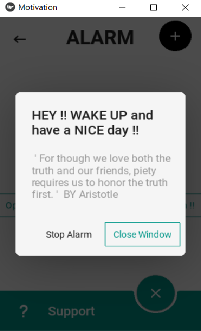

# Project Name : Motivational Alarm App
> With this app you can set up your alarm clock along with a quote theme that you like to read when waking up or for where ever reason you set up your alarm for.

## Table of Contents
* [General Info](#general-information)
* [Technologies Used](#technologies-used)
* [Features](#features)
* [Screenshots](#screenshots)
* [Usage](#usage)
* [Project Status](#project-status)
* [Room for Improvement](#room-for-improvement)
* [Acknowledgements](#acknowledgements)
* [Contact](#contact)
<!-- * [License](#license) -->
## General Information
- Provide general information about your project here.
- What problem does it (intend to) solve?
- What is the purpose of your project?
- Why did you undertake it?
<!-- You don't have to answer all the questions - just the ones relevant to your project. -->
## Technologies Used
-Python3 with the libraries:
       -KivyMD
       -pygame
       -threading
## Features
List the ready features here:
- Setup the alarm clock using a keyboard or visually
- Inscreasing alarm sound volume
- Multiple motivational quotes (more than 45000 quote and 60 theme)
## Screenshots

## Usage
How does one go about using it?
when opening the app, you setup the quote theme then you setup the alarm time. Easy peasy lemon squeezy

## Project Status
Project is: _in progress_ i want to inplement an AI that reads your facial expression and mood and provide you with the quote you need without having to change the theme everytime.
## Room for Improvement

Room for improvement:
- would like the popup screen to appear as soon as the alarm goes off instead of having to click a button
- Stylisticly , i think KivyMD is very limitting . So i would like to improve on the front end of the app
To do:
-learn AI 
## Acknowledgements
Give credit here.
- Watching codemy videos for Kivy helped me with this project https://www.youtube.com/playlist?list=PLCC34OHNcOtpz7PJQ7Tv7hqFBP_xDDjqg

## Contact
- Mohamed Ajimi email : r0913462@student.thomasmore.be

